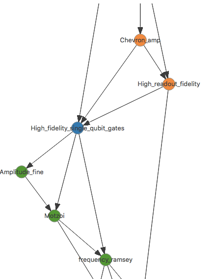

# AutoDepGraph 

[](https://pypi.python.org/pypi/adaptive)
[](https://travis-ci.org/AdriaanRol/AutoDepGraph)
[](https://www.codacy.com/app/adriaan-rol/AutoDepGraph?utm_source=github.com&amp;utm_medium=referral&amp;utm_content=AdriaanRol/AutoDepGraph&amp;utm_campaign=Badge_Grade) 
[](https://coveralls.io/github/AdriaanRol/AutoDepGraph?branch=master)
[](https://zenodo.org/badge/latestdoi/85987885)

AutoDepGraph is a framework for using dependency graphs to calibrate a system. It is heavily inspired by ["Physical qubit calibration on a directed acyclic graph"](https://arxiv.org/abs/1803.03226). 

## Overview
AutoDepGraph consists of two main classes, the CalibrationNode and the Graph.
Calibration is done by calling a node that one wants to execute, the node contains the logic required to satisfy the nodes it depends on (parents).

A CalibrationNode contains:

- parameters
    - state
        + Good (green): check passes
        + needs calibration (yellow): calibration is not up to date anymore and needs to be updated
        + Bad (red): calibration or check has failed
        + unknown (grayed): checks of the node should be run
        + active (blue): calibration or check in progress
    - parents: the nodes it depends on 
    - children: nodes that depend on this node
    - check_function : name of function to be executed when check is called. This can be a method of another instrument.
    - calibrate_function : name of function to be executed when calibrate is called. This can be a method of another instrument.
    - calibration_timeout: time in (s) after which a calibration times out. 

- function
    - execute or call
        + Performs the logic of a node (check state, satisfy requirements) with the goal of moving to a "good" state
    - check
        + Performs checks to determine and the state of a node
    - calibrate
        + Executes the calibration routines of the node

A Graph is a container of nodes, it is used for: 
- new graphs can be created by instantiating a graph and then using the add_node method to define new nodes. 
- loading and saving the graph
- real-time visualization using pyqtgraph
    - state of the node determines color of a node
    - if a node has no calibrate function defined it is a manual node and has a hexagonal instead of a circle as symbol
    - mouseover information lists more properties (planned)



## Examples 
For an introductory example see the example notebook. If you want to see how to use a specific function, see the tests located in the autodepgraph/tests folder.

## Installation
- Clone the repository
- install the [requirements](requirements.txt)
- navigate to the repository and run `pip install -e .`
- verify success of installation by running `py.test`

#### N.B. windows can be "problematic" 
Installation on windows is a bit more difficult, this relates mostly to the installation of pygraphviz. To install graphviz and pygraphviz on windows follow these steps: 

- get the 64 bit version of , copy it to e.g., program files and add the bin folder to the system path.
- the 64 bit version lacks the libxml2.dll, you most likely have this from some other program. You can find this by searching for `libxml2.dll` in the program files folder. After that just copy paste it to the bin folder of graphviz.
- get pygraphviz by downloading the master from github.
- Now you will need to edit pygraphviz/graphviz.i and pygraphviz/graphviz_wrap.c according to the changes at https://github.com/Kagami/pygraphviz/tree/py3-windows-iobase. A reference can be found in the _install folder
- Next install using
```
python setup.py install --include-path="C:\Program Files\graphviz-2.38_x64\include" --library-path="C:\Program Files\graphviz-2.38_x64\lib"
```

- then install autodepgraph and test the installation using `py.test`

## Acknowledgements
I would like to thank Julian Kelly for the idea of using a dependency graph for calibrations and for early discussions. I would like to thank Joe Weston for discussions and help in working out the initial design. I would like to acknowledge Livio Ciorciaro for disucssions and as a coauthor of this project. 
